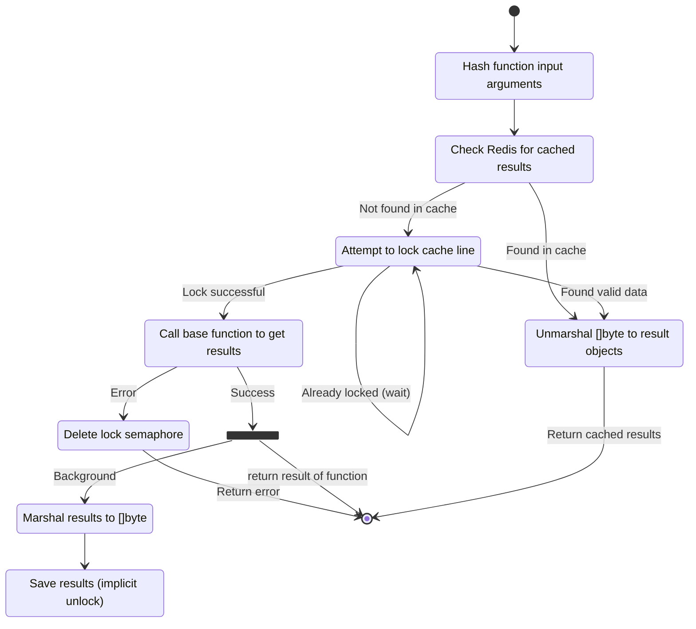

# About

Redis is a common place to store cached information in systems. Normally everyone does a simple implementation of this caching and moves on with life. The downside of this approach is that there are many corner cases in implementing this that are hard to account for. Additionally, there are cases where you really don't want to invoke an expensive operation if it's already been invoked by another instance of your system.

`go-rediscache` is a tool that will take an existing function and wrap all of the caching logic around it with no additional work by the caller. This is aimed at having a very clean and testable system since the only responsibility of the caller is to supply a function that does work.

As a bonus, this works well with the concepts that are used in the related library `go-ctxdep`.

# Usage

Instantiate a new `go-rediscache` object:

```go
redisConnection := redis.NewClient(&redis.Options{
    Addr: "localhost:6379",
})

cache := &rediscahce.NewRedisCache(ctx, redisConnection, CacheOptions{
        TTL:       time.Minute,
        LockTTL:   time.Minute,
        LockWait:  time.Second * 10,
        LockRetry: time.Millisecond * 200,
        KeyPrefix: "GoCache-"
    })
```

Then, given any function:

```go

func getUserInfo(ctx context.Context, userId string) (string, error) {}

cachedUserInfoFunc := rediscache.Cache(cache, getUserInfo)

result, err := cachedUserInfoFunc(ctx, "User42")
```

If the user's info was already cached, it will be returned without calling the function. Otherwise, the function is called and the results will be saved.


## Requirements

The requirements for introducing `go-rediscache` to your system are that the parameters of the function can be used to generate a hash. Underlying this, the function should be stable, such that invoking the same function for the same parameters should generate identical (or identical semantically) results. The results also need to be able to be marshaled and unmarshalled from to a `[]byte`.

From a high-level perspective, all the inputs are used to construct the cache key which is used to access Redis. The outputs of the function are then saved in the cache. If the same set of inputs are encountered again until the cache expires, the same set of outputs are returned.

Note: The `context.Context` parameter is passed through to the function directly and is _not_ used in the key generation. It is important to ensure that the result of the function that is called does **not** vary based on the context. 

### Input Parameter Requirements

Input parameters must be or implement one of these types:

* `string`
* `Keyable`
* Registered with `RegisterTypeHandler`

The `Keyable` is defined by the library:

```go
// Keyable is an interface that can be implemented by a
// dependency to provide a unique key that can be used to cache the
// result of the dependency. Implementing this interface is required
// if you want to use the Cached() function.
type Keyable interface {
	// CacheKey returns a key that can be used to cache the result of a
	// dependency. The key must be unique for the given dependency.
	// The intent is that the results of calling generators based on the
	// value represented by this key will be invariant if the key is
	// the same.
	CacheKey() string
}
```

### Function Result Requirements

The results of a function may only be:

* `error` types
  * Results of function calls that return a non-`nil` error are not cached
* `Serializable`
* Registered with `RegisterTypeHandler`

In whatever way the serialization and deserialization happen, an object that is serialized the deserialized from the cached `[]byte` should remain semantically identical to the originally returned object.

## State Diagram



# Options

## Timing

The `go-rediscache` was designed to be able to properly interact with the [`go-timing`](https://github.com/gburgyan/go-timing) package. This can be enabled by using the `EnableTiming` flag on the `CacheOptions` object. Enabling this will cause additional timing contexts to be added to the context to record some additional useful details:

* How long the entire cache call took?
* If there was any spinning to get a locked cache line, how long was the wait and how many times did it spin?
* How long the calls to Redis actually took?
* Was the item found in the cache or not?
* How long it took to call the backing function if there was a miss?
* How long did deserialization take?

An example of what this looks like from the output of the unit tests (using a mocked Redis service):

```
redis-cache:string - 23.708µs
redis-cache:string > redis - 14.583µs (cache-hit:true)
redis-cache:string > redis > get - 12.417µs
redis-cache:string > deserialize - 3.125µs
```

In this case, the entire cache workflow took 23.708µs, the result was found in Redis and the call to that took 12.417µs. Once it has serialized results, it took 3.125µs to deserialize it into the actual objects.

The default key looks like `redis-cache:` and the return types of the cached function. If you want to use a different key, you can set that in the `CustomTimingName` field of the options. Note that the `CustomTimingName` does _not_ inherit so there is no chance that setting this at the overall cache level will affect the real calls. 
