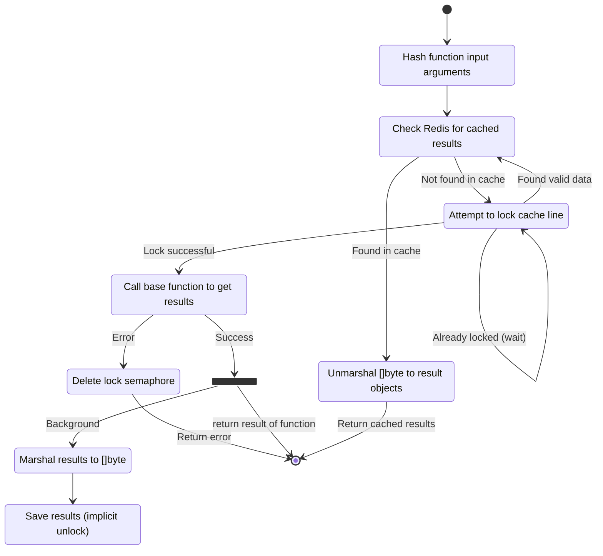

State Diagram

```mermaid
stateDiagram-v2
    HashParams: Hash function input arguments
    RedisCheck : Check Redis for cached results
    LockLine : Attempt to lock cache line
    FillerFunction : Call base function to get results
    SerializeResponse : Marshal results to []byte
    SaveCache : Save results (implicit unlock)
    UnlockLine : Delete lock semaphore
    DeserializeResponse : Unmarshal []byte to result objects
    
    state BackgroundSave <<fork>>
    
    [*] --> HashParams
    HashParams --> RedisCheck
    RedisCheck --> DeserializeResponse : Found in cache
    RedisCheck --> LockLine : Not found in cache
    LockLine --> LockLine : Already locked (wait)
    LockLine --> RedisCheck : Found valid data
    LockLine --> FillerFunction : Lock successful
    FillerFunction --> UnlockLine : Error
    UnlockLine --> [*] : Return error
    
    FillerFunction --> BackgroundSave : Success
    BackgroundSave --> [*] : return result of function
    BackgroundSave --> SerializeResponse : Background
    SerializeResponse --> SaveCache
    DeserializeResponse --> [*] : Return cached results

```
