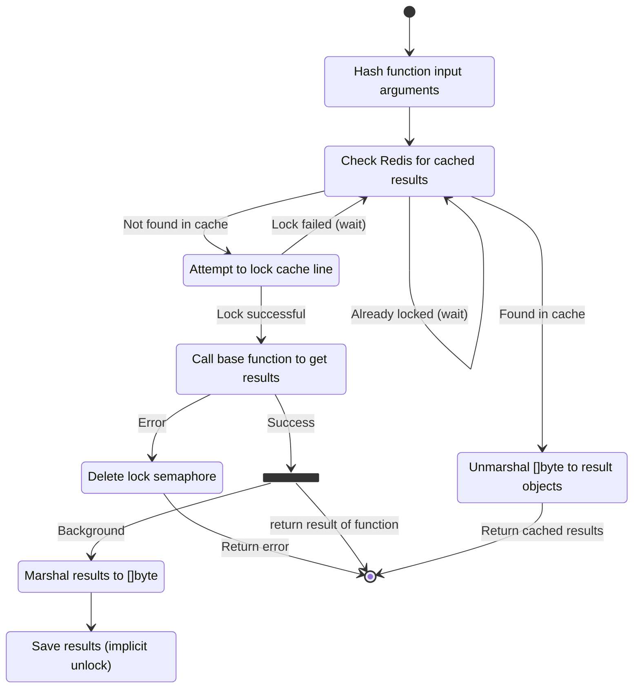

# go-rediscache

`go-rediscache` is a Go package designed to simplify the implementation of caching with Redis. It abstracts away the complexity of managing cache keys, handling concurrency, and ensuring consistency, allowing developers to focus on building reliable and performant applications. Whether you're working with expensive function calls, external API requests, or complex data processing, `go-rediscache` helps you avoid redundant operations and optimize resource usage.

# About

Redis is a common place to store cached information in systems. Normally everyone does a simple implementation of this caching and moves on with life. The downside of this approach is that there are many corner cases in implementing this that are hard to account for. Additionally, there are cases where you really don't want to invoke an expensive operation if it's already been invoked by another instance of your system.

`go-rediscache` is a tool that will take an existing function and wrap all of the caching logic around it with no additional work by the caller. This is aimed at creating and maintaining a very clean and testable system since the only responsibility of the caller is to supply a function that does work.

As a bonus, this works well with the concepts that are used in the related library [`go-ctxdep`](https://github.com/gburgyan/go-ctxdep), though this is in no way a requirement.

## Installation

To install `go-rediscache`, use the following command:

```bash
go get github.com/gburgyan/go-rediscache
```

# Usage

Instantiate a new `go-rediscache` object:

```go
redisConnection := redis.NewClient(&redis.Options{
    Addr: "localhost:6379",
})

cache := rediscache.NewRedisCache(ctx, redisConnection, CacheOptions{
        TTL:       time.Minute,
        LockTTL:   time.Minute,
        LockWait:  time.Second * 10,
        LockRetry: time.Millisecond * 200,
        KeyPrefix: "GoCache-"
    })
```

Then, given any function:

```go

func getUserInfo(ctx context.Context, userId string) (string, error) {}

cachedUserInfoFunc := rediscache.Cache(cache, getUserInfo)

result, err := cachedUserInfoFunc(ctx, "User42")
```

If the user's info was already cached, it will be returned without calling the function. Otherwise, the function is called and the results will be saved.


## Requirements

The requirements for introducing `go-rediscache` to your system are that the parameters of the function can be used to generate a hash. The function should be stable, such that invoking the same function for the same parameters should generate identical (or identical semantically) results. The results also need to be able to be marshaled and unmarshalled from to a `[]byte`.

From a high-level perspective, all the inputs are used to construct the cache key which is used to access Redis. The outputs of the function are then saved in the cache. If the same set of inputs are encountered again until the cache expires, the same set of outputs are returned.

Note: The `context.Context` parameter is passed through to the function directly and is _not_ used in the key generation. It is important to ensure that the result of the function that is called does **not** vary based on the context. 

### Input Parameter Requirements

Input parameters must be or implement one of these types:

* `string`
* `Keyable`
* Registered with `RegisterTypeHandler`
* Able to be written with `binary.Write` 

The `Keyable` is defined by the library:

```go
// Keyable is an interface that can be implemented by a
// dependency to provide a unique key that can be used to cache the
// result of the dependency. Implementing this interface is required
// if you want to use the Cached() function.
type Keyable interface {
	// CacheKey returns a key that can be used to cache the result of a
	// dependency. The key must be unique for the given dependency.
	// The intent is that the results of calling generators based on the
	// value represented by this key will be invariant if the key is
	// the same.
	CacheKey() string
}
```

Regardless of _how_ the key is made, it is critical that anything that can affect the result of the function call must make it into the key.

### Function Result Requirements

The results of a function may only be:

* `error` types
  * Results of function calls that return a non-`nil` error are not cached
* `Serializable`
* Registered with `RegisterTypeHandler`

In whatever way the serialization and deserialization happen, an object that is serialized the deserialized from the cached `[]byte` should remain semantically identical to the originally returned object.

### Pointers

There is no special handing of pointers in this package. There are default serializers for some common types, but there is no magic around pointers.

If you need to add a handler for a pointer type:

```go
// Non-pointer version
cache.RegisterTypeHandler(reflect.TypeOf((*someType)(nil)).Elem(), rediscache.JsonSerializer, rediscache.JsonDeserializer)

// reflect.TypeOf((*someType)(nil)).Elem() can be replaced with reflect.TypeOf(someType{}) as they
// are generally interchangeable.

// Pointer version
cache.RegisterTypeHandler(reflect.TypeOf((*someType)(nil)), rediscache.JsonSerializer, rediscache.JsonDeserializer)
```

In this case, this is using the included JSON serializer and deserializers. The two lines above are distinct and deal with two different types with differing semantics. This package does not want to assume what the caller's requirements are.

The included JSON serializer and deserializer handles both instances and pointers just fine.

## State Diagram



# Options

## Configuration Options

The `CacheOptions` struct allows you to customize the behavior of the cache:

- `TTL`: Defines the time-to-live for each cache entry. Default is 5 minutes.
- `LockTTL`: Specifies the duration for which the cache line is locked during a cache miss to prevent race conditions. Default is 10 seconds.
- `LockWait`: The maximum duration to wait for a lock to be released before giving up. Default is 10 seconds.
- `LockRetry`: The interval between retries when waiting for a lock. Default is 100 milliseconds.
- `KeyPrefix`: The prefix for all cache keys to avoid collisions with other cache entries in Redis. Default is "GoCache-"
- `CustomTimingName`: If using the integration with `go-timing`, this is the name that is used for the timing nodes that are used for cache timing. Default is the types of the result objects.
- `EncryptionHandler`: If encrypting the cached values stored in Redis, this provides the encryption and decryption functions. The default is storing the values unencrypted and relying on Redis's security to prevent access.

## Timing

The `go-rediscache` was designed to be able to properly interact with the [`go-timing`](https://github.com/gburgyan/go-timing) package. This can be enabled by using the `EnableTiming` flag on the `CacheOptions` object. Enabling this will cause additional timing contexts to be added to the context to record some additional useful details:

* How long the entire cache call took?
* If there was any spinning to get a locked cache line, how long was the wait and how many times did it spin?
* How long the calls to Redis actually took?
* Was the item found in the cache or not?
* How long it took to call the backing function if there was a miss?
* How long did deserialization take?

An example of what this looks like from the output of the unit tests (using a mocked Redis service):

```
redis-cache:string - 23.708µs
redis-cache:string > redis - 14.583µs (cache-hit:true)
redis-cache:string > redis > get - 12.417µs
redis-cache:string > deserialize - 3.125µs
```

In this case, the entire cache workflow took 23.708µs, the result was found in Redis and the call to that took 12.417µs. Once it has serialized results, it took 3.125µs to deserialize it into the actual objects.

The default key looks like `redis-cache:` and the return types of the cached function. If you want to use a different key, you can set that in the `CustomTimingName` field of the options. Note that the `CustomTimingName` does _not_ inherit so there is no chance that setting this at the overall cache level will affect the real calls. 

## Encryption and Security

Since the cache values are stored in Redis, which depending on how things are set up in your environment, there are cases where having the values encrypted is a needed feature.

You can set the `EncryptionHandler` to an object that implements the same interface name:

```go
type EncryptionHandler interface {
	Encrypt([]byte) ([]byte, error)
	Decrypt([]byte) ([]byte, error)
}
```

Ensure that:

```go
plaintext []byte{ ...}

cyphertext, _ := provider.Encrypt(plaintext)
decrypted, _ := provider.Decrypt(cyphertext)

Assert.Equal(t, plaintext, decrypted)
```

It is important that all instances of a cache that access the same Redis backend be able to decrypt each other's data.

You can use any encryption method that is suitable for your use case. Keep in mind that the cached values may be relatively stable so some information leakage may be present if one were to run a correlation attack against everything stored in Redis. If this is important, something that may be considered is having some salting present in the provided algorithm.

The key generation process employs the SHA-256 hashing algorithm, which is recognized for its cryptographic security. Given the requirement for deterministic key generation, the use of salting is not feasible as it would disrupt the stability of the generated keys. Consequently, the primary attack vectors are limited to correlation attacks, such as identifying the presence of a specific key when a particular user, e.g., Alice, logs in. Even with salting, given the requirement of stable keys, most attacks would still be possible. Note that this is a limitation of storing things in a database of any type, and not specifically related to this package.

Regardless of what is in this README, always do your own research and be aware of any pitfalls around the entire topic of security.

# License

This project is licensed under the MIT License - see the [LICENSE](LICENSE) file for details.