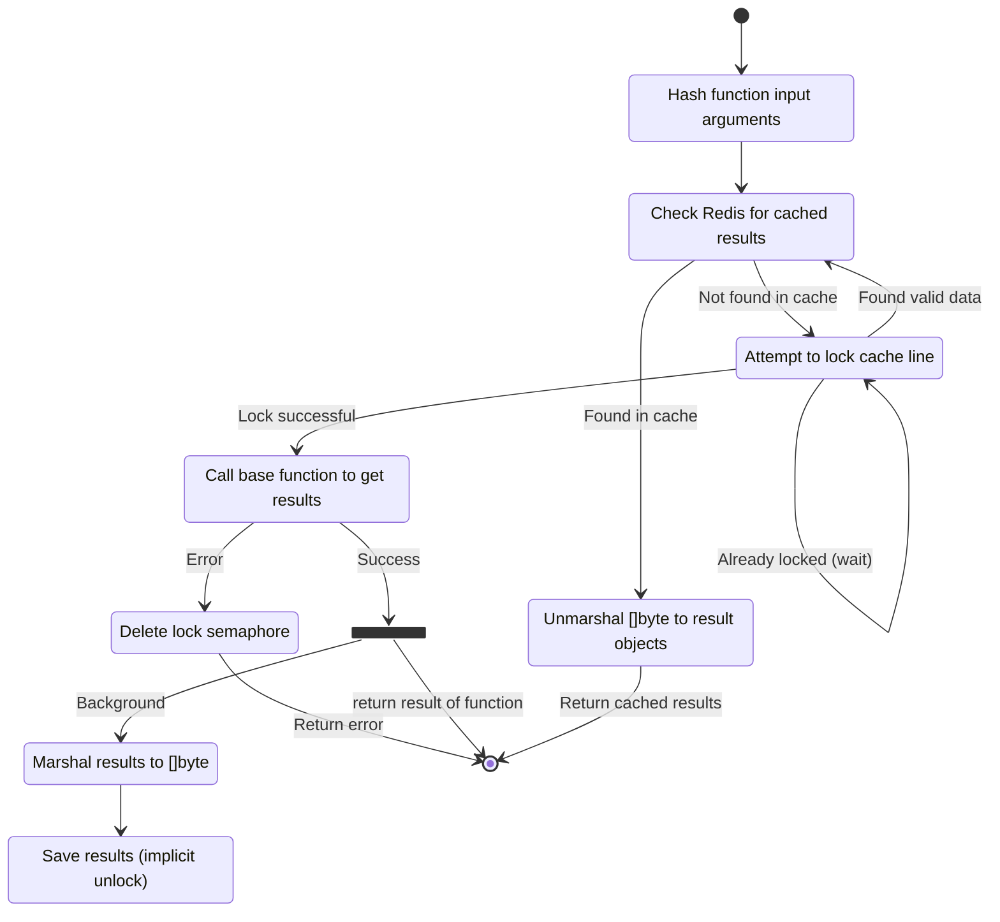

# About

Redis is a common place to store cached information in systems. Normally everyone does a simple implementation of this caching and moves on with life. The downside of this approach is that there are many corner cases in implementing this that are hard to account for. Additionally, there are cases where you really don't want to invoke an expensive operation if it's already been invoked by another instance of your system.

`go-rediscache` is a tool that will take an existing function and wrap all of the caching logic around it with no additional work by the caller. This is aimed at having a very clean and testable system since the only responsibility of the caller is to supply a function that does work.

As a bonus, this works well with the concepts that are used in the related library `go-ctxdep`

## Requirements

The requirements for introducing `go-rediscache` to your system are that the paramaters of the function can be used to generate a hash. Underlying this, the function should be stable, such that invoking the same function for the same paramaters should generate identical (or identical semantically) results. The results also need to be able to be marshaled and unmarshalled from to a `[]byte`.

## State Diagram

